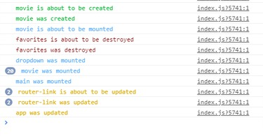

[](https://www.npmjs.com/package/vue-lifecycle-log)

# Vue lifecycle log

> A Vue.js plugin to log lifecycles of the components

## Usage

Installation

```sh
npm install --save vue-lifecycle-log
```

Import it on your entry file (normally `main.js`) and use it with Vue. It is automatically disabled on production mode.

```javascript
import Vue from 'vue'
import LogLifecycles from 'vue-lifecycle-log'

Vue.use(LogLifecycles)
```

It uses the component's `name` for logging, so if you don't have it defined, it will print undefined



### Configuring lifecycles to print

The lifecycles to print can be filtered by passing an array in the plugin options, like:

```javascript
import Vue from 'vue'
import LogLifecycles from 'vue-lifecycle-log'

Vue.use(LogLifecycles, { lifecycles: ['created', 'beforeDestroy'] })
```

Passing an empty array will print all of them.
